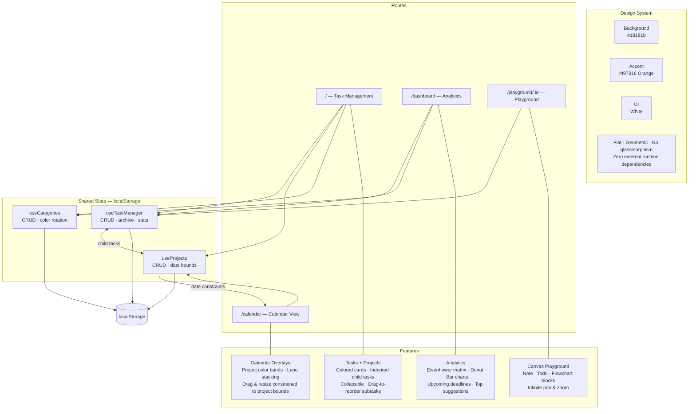

<div align="center">

# MC-Todo

Task management, calendar visualization, productivity analytics, and a per-task playground — all in one place.

[](https://nextjs.org/)
[](https://react.dev/)
[](https://www.typescriptlang.org/)
[](https://tailwindcss.com/)
[](https://jestjs.io/)

</div>

---

## Design System & Architecture



---

## Getting Started

```bash
# Install dependencies
npm install

# Development server
npm run dev

# Run tests
npm test

# Production build
npm run build
```

Open [http://localhost:3000](http://localhost:3000) in your browser.

---

## Features

### Task Management `/`
- **Projects** — color-coded, time-bounded containers with collapsible indented child tasks; inline add/edit/delete
- **Tasks** — title, details, priority (0–10), status, due date range, reference links, subtasks
- **Date Picker** — single-click or drag to select a range; highlights project time frame and dims out-of-bounds days when a project is selected
- **Auto-Archive** — completed tasks archived after 3 / 7 / 14 / 30 days; restore or bulk-delete
- **Search & Filter** — full-text, status (6 options), and category filters with active-filter counter
- **View Modes** — Priority list (table) and Category board (Kanban), persisted preference
- **Keyboard Shortcuts** — `N` new task · `/` focus search

### Calendar View `/calendar`
- **Project Overlays** — translucent color bands spanning each project's date range, rendered behind events
- **Drag & Drop** — reschedule events with live preview; project tasks snap back if dropped outside project bounds
- **Edge Resize** — extend or shrink multi-day events; clamped to project bounds for project tasks
- **Smart Stacking** — lane allocation prevents event collisions; collapses to lines when dense
- **Quick Create** — double-click any cell to open the task modal with that date pre-filled
- **Trash Zone** — drag any event to delete it

### Dashboard `/dashboard`
- Key metrics — total, completed %, overdue, in-progress
- Eisenhower-style scatter plot (urgency × importance), donut chart, category & priority bar charts
- Upcoming deadlines, top 3 suggested tasks, inline category editor

### Playground `/playground/:taskId`
- Infinite canvas with pan and zoom (0.25×–2×, cursor-centered)
- **Note** — rich-text editor with formatting toolbar and 6 color themes
- **Todo List** — checklist with drag-to-reorder and completion indicator
- **Flowchart** — node/edge diagram with 3 shapes, 4 edge styles, labels, and auto port selection
- All blocks: drag, resize, z-index, delete; debounced auto-save per task

---

## Tech Stack

| Layer | Technology |
|-------|-----------|
| Framework | Next.js 16.1.6 (App Router) |
| UI | React 19.2.3 |
| Language | TypeScript 5 |
| Styling | Tailwind CSS v4 |
| Testing | Jest 30 — 28 test files · 395 tests |
| State | Custom hooks + `localStorage` via `useSyncExternalStore` |

---

## Project Structure

```
app/
├── components/
│   ├── task/       # TaskModal · TaskList · TaskItem · DatePicker
│   │               # PriorityListView · CategoryBoardView
│   │               # ProjectItem · ProjectModal · SubtaskList
│   ├── calendar/   # CalendarGrid · CalendarEvent · ProjectOverlay
│   │               # CalendarEventPopover · DragPreviewEvent · TrashDropZone
│   ├── dashboard/  # StatCard · Charts · TimeManagementMatrix
│   │               # UpcomingDeadlines · CategoryEditModal
│   ├── playground/ # PlaygroundCanvas · NoteBlock · TodoListBlock · FlowchartBlock
│   └── ui/         # Button · Dropdown · Input · Modal · Slider · Textarea
├── hooks/          # useTaskManager · useProjects · useCategories
│                   # useEventDrag · useEventResize · useDashboardStats
│                   # useLocalStorage · useTaskFilter · usePlayground
├── lib/            # utils · calendarUtils · dashboardUtils
├── types/          # task.ts · calendar.ts · playground.ts
└── __tests__/      # Jest test suite
```

---

## License

Private project.
